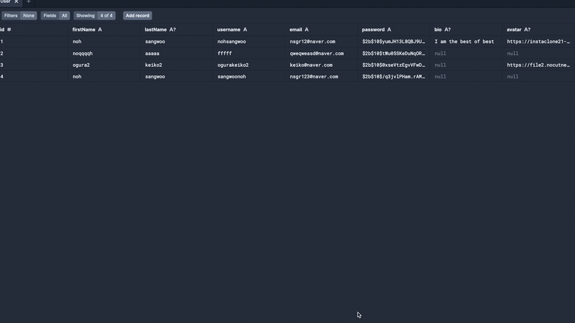
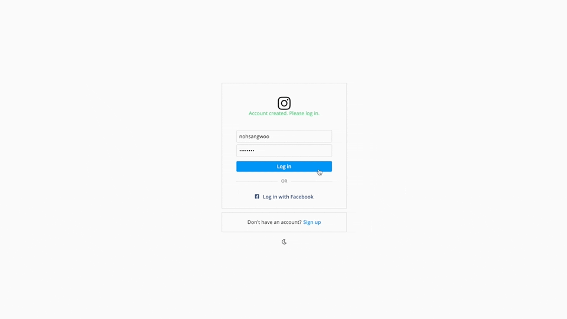
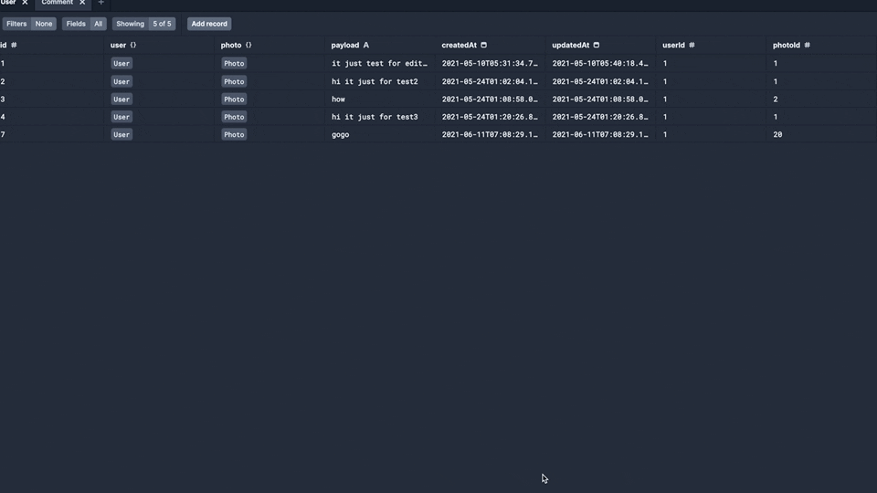

# Instagram Frontend

- https://github.com/nohsangwoo/instaclone-backend-v3 와 연동됩니다(BackEnd)
- deploy: https://insta-front-end-v3-noh.netlify.app/
  (백엔드배포된 서비스의 상태가 무료버전이라 처음 접속시 sleep된상태에서 깨어나느라 조금 시간이 걸림(1~2분정도 기다려야함))

# 설명에 첨부된 gif파일 크기로 인하여 readme파일을 불러오는데 시간이 좀더 소요될 수 있습니다. 많이 기다려주세요.

<br><br>

<hr>
<br><br>

# 구현 내용 및 컨셉

|         user        |       Photos       |
|:-------------------:|:------------------:|
| ✔ Email Login       | ✔ Search Photo     |
| ✔ User Profile      | ✔ Like Photo       |
| ✔ Follow / Unfollow | ✔ Commet on Photos |
| ✔ Direct Messages   | ✔ Photo Feed       |
|                     | ✔ Upload Photo     |


|       App       | Deployment |
|:---------------:|:----------:|
| ✔ Navigation    | ✔ Heroku   |
| ✔ Camera        | ✔ Netlify  |
| ✔ Permissions   |            |
| ✔ Media Library |            |
| ✔ Geolocation   |            |


<br><br>
<hr>
<br><br>

# 사용된 기술

- ReactJS
- typescript(for javascript)
- apollo-graphql(for graphql)
- websocket(for realtime subscription)
- reactiveVariable
- react-hook-form
- styled-components
- sanitize-html
- prisma studio(DB제어및확인)

<br><br>

<hr>
<br><br>

## 웹은 간단하게 구성
- 프로젝트의 고도화는 react native(app)에서 진행


<br><br>

<hr>
<br><br>


# 회원가입

<br><br>


- 회원 가입 기능 구현
- 회원가입 직후 바로 로그인 가능하게 로그인창으로 아이디와 비밀번호를 전달받는다
- prisma studio로 등록된 회원 확인


<br><br>

<hr>
<br><br>


# 로그인

<br><br>


- 로그인 기능 구현
- 로그인후 백엔드로 부터 토큰을 받아 localstorage에 저장 및 reactive Variable을 이용하여 로그인 상태 제어
- 로그인 후 초기 페이지는 Feed


<br><br>

<hr>
<br><br>


# Write a comment(caching on apollo) & delete a comment

<br><br>

- comment추가 mutation 실행 후 추가된 comment를 리렌더링 하기위해 refetching 대신 cache를 직접 제어한다
- cache를 제어하는 경우 DB와 백엔드 서버의 부하를 줄이고 불필요한 자원소모를 방지한다.
- comment제거 mutation 또한 마찬가지 작업을 진행해준다


<br><br>

<hr>
<br><br>


# Like


<br><br>

- instagram의 좋아요 기능 구현 
- DB와 백엔드 서버의 부하를 줄이고 불필요한 자원소모를 방지하기 위해 refetching 대신 apollo cache를 직접 제어한다
- 리렌더링시 cache가 업데이트된 데이터를 기준으로 리렌더링 된다


<br><br>

<hr>
<br><br>


# Profile


<br><br>

- instagram의 profile 기능
- 내 정보의 현황을 제공하는 페이지
- followers, following, username, my all feeds(축약 hover시 좋아요수 댓글수 표시)


<br><br>

<hr>
<br><br>


# 이하 개발 내용 설명


<br><br>

<hr>
<br><br>
# Installing All
```
$npx create-react-app "프로젝트이름" —template typescript
```

- styled components
  https://styled-components.com/
- react-hook-form
  https://react-hook-form.com/
- react-router-dom
  https://reactrouter.com/web/guides/quick-start
- @apollo/client graphql
  https://www.apollographql.com/docs/react/get-started/
- react-helmet-async
  https://www.npmjs.com/package/react-helmet-async

```
npm i styled-components react-hook-form react-router-dom @apollo/client graphql react-helmet-async
```

- react fortawesome
  npm i --save @fortawesome/fontawesome-svg-core
  npm install --save @fortawesome/free-solid-svg-icons
  npm install --save @fortawesome/react-fontawesome
  npm install --save @fortawesome/free-brands-svg-icons
  npm install --save @fortawesome/free-regular-svg-icons
  

- 주요 사용된 라이브러리
  @apollo/client,
  @fortawesome/fontawesome-svg-core,
  @fortawesome/free-brands-svg-icons,
  @fortawesome/free-regular-svg-icons,
  @fortawesome/free-solid-svg-icons,
  @fortawesome/react-fontawesome,
  graphql,
  react-helmet-async,
  react-hook-form,
  react-router-dom,
  styled-components

<br><br>

<hr>
<br><br>


# Router Setup part

- react router dom (묻고 따지지도 않고 걍 사용)

<br><br>

<hr>
<br><br>

# Reactive Variables

- 사용법

1. makeVar를 이용하여 선언
2. app.tsx파일(최상단 경로)에서 useReactiveVar로 hooks설정해줌
3. 어디서든 선언된 변수명(설정하고싶은 값)형식으로 사용가능

- cache 기능 등... 참고
  https://github.com/apollographql/ac3-state-management-examples/tree/master/apollo-local-state/src


<br><br>

<hr>
<br><br>

# GlobalStyles on Styled Components

- globalStyles를 사용하여 body에 적용될 기본적인 default css를 적용
- styled-reset을 사용하여 css reset 효과 적용


<br><br>

<hr>
<br><br>


# typescript for graphql

- npm install -g apollo
  apollo client:codegen
  https://github.com/apollographql/apollo-tooling#apollo-clientcodegen-output 참고
- graphql 서버에서 스키마를 다운로드 받아 적용할것임
- configuration파일 생성 (apollo.config.js)
  https://www.apollographql.com/docs/devtools/apollo-config/

- 백엔드에서 스키마 끌어오기

```
apollo client:codegen src/__generated__ --target=typescript --outputFlat
```


<br><br>

<hr>
<br><br>


# Helmet Component

- title및 파싱에 사용될 정보를 추가하여 SEO에 보다 유리하게 함(걍 NEXTJS 사용하자)
- react helmet 사용법
  https://www.npmjs.com/package/react-helmet


<br><br>

<hr>
<br><br>


# React Hook Form

- react hook form 사용법
  https://react-hook-form.com/


<br><br>

<hr>
<br><br>


# 일반 react form Typescript 적용 예시

```
  <!-- typescript 적용 예시 -->
  const [username, setUsername] = useState('');
  const [usernameError, setUsernameError] = useState('');
  const onUsernameChange = (event: React.ChangeEvent<HTMLInputElement>) => {
    setUsernameError('');
    setUsername(event.target.value);
  };
  const handleSubmit = (event: React.FormEvent) => {
    event.preventDefault();
    if (username === '') {
      setUsernameError('Not empty pls.');
    }
    if (username.length < 10) {
      setUsernameError('too short');
    }
  };
  .....
  .....

  return(
    <form onSubmit={handleSubmit}>
      {usernameError}
      <Input
        onChange={onUsernameChange}
        value={username}
        type="text"
        placeholder="Username"
    />
    ...
  )
```


<br><br>

<hr>
<br><br>


# Apollo Client

- backend와 연동을 위한 셋업
- 또한 reactVariable의 persist 적용방법을 학습
- localStorage에 저장된 token을  http의 header에 저장하고 사용하기위한 설정


<br><br>

<hr>
<br><br>


# Login part

- useForm과 apollo hook, apollo reactive variable, localStorage등을 이용하여 로그인 상태 관리
- https://www.youtube.com/watch?v=ZBfBiwyR2HY 참고

- onChange 사용시 react hooks form 이 깨져버리는? 상태 발생
- setError 사용법 연구 필요(버그일 확률 높음)


<br><br>

<hr>
<br><br>


# Redirecting Users

- useHistory 이용하여 변수와 함께 push
- useLocation이용하여 변수와 함께 props를 받아옴


<br><br>

<hr>
<br><br>


# Dark Mode

- themeProvider사용하여 darkmode세팅


<br><br>

<hr>
<br><br>


# Header and Layout

- 로그인 한 상태의 home에서 최상위 레이아웃 설계
- navigation..
- header 부분 아이콘 추가 및 마무리
- 사용자가 브라우저에서 전달받은 토큰을 변경하여 장난치면 바로 로그아웃됨


<br><br>

<hr>
<br><br>


# isLiked

- login user가 해당 feed에 like를 했는지 여부
- like 테이블에서 연결된 photoId와 userId를 찾고 해당조건에 만족하는 like가 있으면 true를 반환하고 없으면 false를 반환


<br><br>

<hr>
<br><br>


# onClick 으로 Mutation 실행하려면 새로운 함수안에서 호출 하는게 편함


<br><br>

<hr>
<br><br>


# Liking Photos

- like unlike기능인 ToggleLike기능 구현


<br><br>

<hr>
<br><br>


# Refetching Queries

- updating apollo cache
- useMutation의 인자중 refetchQueries를 뽑아서 사용

```
const [toggleLikeMutation, { loading }] = useMutation(TOGGLE_LIKE_MUTATION, {
    variables: {
      id,
    },
    refetchQueries:[FEED_QUERY,variable:{enter variable...}] <== 요렇게 사용한다
  });
```

- mutation이 완료된 이후 refetchQueries를 실행하여 말그대로 해당쿼리내용을 다시 fetch하는 것
- 해당 쿼리를 완전히 다시 실행하는것과 동일한 작업이기때문에 좋은 방법은 아님 (귀찮을때 사용)


<br><br>

<hr>
<br><br>


# writeFragment

- mutation이후 행동하는 작업중 update를 이용하여 cache를 update해준다
- update는 백엔드에서 받은 데이터를 주는 function이고
- components/feed/photo.tsx에서 예시
- cache 덮어씌우는 방법 학습
- 사용예시

```
function Photo({ id, user, file, isLiked, likes }: Props) {
  useEffect(() => {}, [user.username]);
  // cache: InMemoryCache 부분이랑 ,
  //   Backend에서 받아온 Result부분
  const updateToggleLike = (cache: any, result: any) => {
    console.log(cache, result);
    const {
      data: {
        toggleLike: { ok },
      },
    } = result;
    // Mutation이 성공적으로 작동하여 제대로 데이터를 받아왔다면
    if (ok) {
      cache.writeFragment({
        //   덮어 씌울 대상의 ID가 필요함
        // id확인은 apollo dev tools에서 확인가능
        // useQuery로 이미 cache에 저장된 내용중
        // 덮어씌울 대상의 type(mutation의 반환 type)과 덮어씌울 대상의 id
        // (내가 덮어씌우길 원하는 대상을 id로 구분 (where과 비슷한느낌))
        // 찾은 조건에서 덮어씌울 조건의 상용구로 사용
        id: `Photo:${id}`,
        // 위 단계에서 덮어씌울 대상을 정밀하게 찾아냈다면
        // fragment에선 어디에 덮어씌울건지 대상을 찾음
        // photo의 어떤 feild에 덮어씌울지?
        fragment: gql`
          # 패턴을 외우셈 : fragment 아무이름 on Photo{...}
          # 아무 이름 부분은 정말 의미 없이 아무이름을 적으면됨
          #   여기선 photo의 isLiked부분을 덮어씌우겠다고 하는 의미
          fragment BSName on Photo {
            isLiked
          }
        `,
        // 이제 어떤 데이터를 덮어씌울것인지 찾음
        // 덮의 씌울 대상은 위에서 찾은 isLiked이고
        // 덮어씌울 값은 useQeury를 이용하여 seeFeed를 실행한 반환값중
        // 최신화된 isLiked의 반전값으로 덮어씌우겠다는거임
        // 내용에 따라 어떤값을 덮어씌우든 마음대로
        // 이 경우 기능은 isLiked가 토글되는 개념이기에 이렇게 구현
        data: {
          isLiked: !isLiked,
        },
      });
      //   cache.writeFragment({
      //     id: `User:${1}`,
      //     fragment: gql`
      //       fragment BSName on User {
      //         username
      //       }
      //     `,
      //     data: {
      //       username: 'nohsangwoo',
      //     },
      //   });
    }
  };
  const [toggleLikeMutation, { loading }] = useMutation<
    //   트리거에서 전달 받는 인자
    { toggleLike: { id: number } },
    // hooks에서(여기서) 전달 하는 인자
    { id: number }
  >(TOGGLE_LIKE_MUTATION, {
    variables: {
      id,
    },

    update: updateToggleLike,
  });

  console.log('loading', loading);

  const tpggleLikeFunc = () => {
    toggleLikeMutation();
  };

```


<br><br>

<hr>
<br><br>


# readFragment

- cache update에서 업데이트하고 싶은(덮어씌울 데이터가 없을때 불러오는 방법)
- update시 cache에 저장된 데이터를 불러오는 방법
- 사용법

```
function Photo({
  id,
  user,
  file,
  isLiked,
  likes,
  caption,
  commentNumber,
  comments,
}: Props) {
  useEffect(() => {}, [user.username]);
  // cache: InMemoryCache 부분이랑 ,
  //   Backend에서 받아온 Result부분
  const updateToggleLike = (cache: any, result: any) => {
    console.log(cache, result);
    const {
      data: {
        toggleLike: { ok },
      },
    } = result;
    // Mutation이 성공적으로 작동하여 제대로 데이터를 받아왔다면
    if (ok) {
      // cache에 저장된 어떤 데이터를 가져오고 싶을때(말그대로 readFragment)
      const fragmentId = `Photo:${id}`;
      const fragment = gql`
        fragment BSName on Photo {
          isLiked
          likes
        }
      `;
      //   위 정보를 취합하여 실제로 cache에서 데이터를 불러와 result에 담아준다
      const result = cache.readFragment({
        id: fragmentId,
        fragment,
      });

      // result안에 해당 인자가 존재한다면(안전장치)
      if ('isLiked' in result && 'likes' in result) {
        //   isLike와 likes에 각각 별명을 붙여주고
        const { isLiked: cacheIsLiked, likes: cacheLikes } = result;
        // writeFragment를 진행하면서 불러온 데이터로 덮어씌워준다
        cache.writeFragment({
          id: fragmentId,
          fragment,
          data: {
            isLiked: !cacheIsLiked,
            likes: cacheIsLiked ? cacheLikes - 1 : cacheLikes + 1,
          },
        });
      }
    }
  };
  const [toggleLikeMutation, { loading }] = useMutation<
    //   트리거에서 전달 받는 인자
    { toggleLike: { id: number } },
    // hooks에서(여기서) 전달 하는 인자
    { id: number }
  >(TOGGLE_LIKE_MUTATION, {
    variables: {
      id,
    },

    update: updateToggleLike,
  });

  console.log('loading', loading);

  const tpggleLikeFunc = () => {
    toggleLikeMutation();
  };

  return (
    <PhotoContainer key={id}>
      <PhotoHeader>
        <Avatar lg url={user.avatar} />
        <Username>{user.username}</Username>
      </PhotoHeader>
      <PhotoFile src={file} />
      <PhotoData>
        <PhotoActions>
          <div>
            <PhotoAction onClick={tpggleLikeFunc}>
              <FontAwesomeIcon
                style={{ color: isLiked ? 'tomato' : 'inherit' }}
                icon={isLiked ? SolidHeart : faHeart}
              />
            </PhotoAction>
            <PhotoAction>
              <FontAwesomeIcon icon={faComment} />
            </PhotoAction>
            <PhotoAction>
              <FontAwesomeIcon icon={faPaperPlane} />
            </PhotoAction>
          </div>
          <div>
            <FontAwesomeIcon icon={faBookmark} />
          </div>
        </PhotoActions>
        <Likes>{likes === 1 ? '1 like' : `${likes} likes`}</Likes>
        <Comments
          author={user.username}
          caption={caption}
          commentNumber={commentNumber}
          comments={comments}
        />
      </PhotoData>
    </PhotoContainer>

```


<br><br>

<hr>
<br><br>


# Parsing Hashtags

- replace witch regex
- sanitize-html (html문법 보호를 해제)
  https://www.npmjs.com/package/sanitize-html 참고
  사용법 학습(허용하고자하는 html tag를 관리할수 있음 허용되지 않은 tag는 string으로 표현된다)

  - dangerouslySetInnerHTML

  ```
  function Comment({ author, payload }: Props) {
  // allowedTags로 허용한 tag만 기능으로 인식하게 만들어줌
  //   (여기선 mark태그만 허용한것 )
  // 그외 tag는 string으로 표현됨(사용자의 공격으로부터 보호함)
  const cleanedPayload = sanitizeHtml(
    payload.replace(/#[\w]+/g, '<mark>$&</mark>'),
    {
      allowedTags: ['mark'],
    }
  );
  return (
    <CommentContainer>
      <FatText>{author}</FatText>
      <CommentCaption
        dangerouslySetInnerHTML={{
          __html: cleanedPayload,
        }}
      />
    </CommentContainer>
  );
  }

  ```

  모든 태그에는 html을 허용하는 태그가 존재함 but 매우 위험한 작업이어서 기본적으로 모든 태그를 하드코딩이 아닌 상태로 입력받은경우는 string으로 표현하게 됨
  이 작업을 풀어주는 게 dangerouslySetInnerHTML 설정


<br><br>

<hr>
<br><br>


# Parsing Hashtags part Two

- html 허용하는 방식 변경


<br><br>

<hr>
<br><br>


# cache Modify

- apollo v3에서 새로 생긴기능
- 사용법이 간단하고 변경하려는 cache값의 이전값을 이용하여 간단하게 변경하는 경우 아주 간단하고 유용하게 사용할 수 있음
- 사용법

```
function Photo({
  id,
  user,
  file,
  isLiked,
  likes,
  caption,
  commentNumber,
  comments,
}: Props) {
  useEffect(() => {}, [user.username]);
  // cache: InMemoryCache 부분이랑 ,
  //   Backend에서 받아온 Result부분
  const updateToggleLike = (cache: any, result: any) => {
    // console.log(cache, result);
    const {
      data: {
        toggleLike: { ok },
      },
    } = result;
    // Mutation이 성공적으로 작동하여 제대로 데이터를 받아왔다면
    if (ok) {
      const photoId = `Photo:${id}`;
      cache.modify({
        id: photoId,
        fields: {
          isLiked(prev: boolean) {
            return !prev;
          },
          likes(prev: number) {
            if (isLiked) {
              return prev - 1;
            }
            return prev + 1;
          },
        },
      });
    }
  };
  const [toggleLikeMutation, { loading }] = useMutation<
    //   트리거에서 전달 받는 인자
    { toggleLike: { id: number } },
    // hooks에서(여기서) 전달 하는 인자
    { id: number }
  >(TOGGLE_LIKE_MUTATION, {
    variables: {
      id,
    },

    update: updateToggleLike,
  });

  console.log('loading', loading);

  const tpggleLikeFunc = () => {
    toggleLikeMutation();
  };

  return (
    <PhotoContainer key={id}>
      <PhotoHeader>
        <Avatar lg url={user.avatar} />
        <Username>{user.username}</Username>
      </PhotoHeader>
      <PhotoFile src={file} />
      <PhotoData>
        <PhotoActions>
          <div>
            <PhotoAction onClick={tpggleLikeFunc}>
              <FontAwesomeIcon
                style={{ color: isLiked ? 'tomato' : 'inherit' }}
                icon={isLiked ? SolidHeart : faHeart}
              />
            </PhotoAction>
            <PhotoAction>
              <FontAwesomeIcon icon={faComment} />
            </PhotoAction>
            <PhotoAction>
              <FontAwesomeIcon icon={faPaperPlane} />
            </PhotoAction>
          </div>
          <div>
            <FontAwesomeIcon icon={faBookmark} />
          </div>
        </PhotoActions>
        <Likes>{likes === 1 ? '1 like' : `${likes} likes`}</Likes>
        <Comments
          author={user.username}
          caption={caption}
          commentNumber={commentNumber}
          comments={comments}
        />
      </PhotoData>
    </PhotoContainer>
  );
}
```


<br><br>

<hr>
<br><br>


# Create Comment

- feed에 댓글다는 기능
- cache직접 제어


<br><br>

<hr>
<br><br>


# Delete Comment

- cache에 존재하는 comment를 지우는 방법(use evict)
  사용법

```
cache.evict({ id: `Comment:${id}` });
```


<br><br>

<hr>
<br><br>


# useParams

- react-router-dom을 이용하여 전달받은 params를 쉽게 이용하는 방법


<br><br>

<hr>
<br><br>


# Queries and Fragments

- 자주 사용하는 쿼리를 모듈화 해서 재사용 하는 방법
  src/fragment와 Profile안의 내용 참조


<br><br>

<hr>
<br><br>


# keyFields

- 보통은 id를 query로 불러오면 이것을 apollo가 자동으로 인식하여 고유식별자로 인식하고
  cache에 하나의 객체로 저장해주는데
- 때론 어떤이유로 id를 불러오지 않는경우에는 ROOT_QUERY에 다 때려박아버린다.
- 그래서 일련의 규칙으로 고유식별자를 따로 지정해주고 그것을 기준으로 cache에
  따로 나뉘어진 새로운 객체로 저장하게 만들어 주기위해 apollo.tsx에서 InMemoryCache의 typePolicies설정을해준다


<br><br>

<hr>
<br><br>


# Follow Unfollow

- cache update 시 onComplete방식으로 업데이트 하는 방법 (profile.tsx)
- 내가 follow 한 상대의 cache에서 follower부분을 변경했다면
- 나의 following의 cache부분도 변경해주는것


<br><br>

<hr>
<br><br>


# deploty

공통룰은 NODE_ENV로 설정되는 변수값으로 배포되고있는데 NODE_ENV를 이용하여 백엔드 주소를 설정해준다

# https://docs.netlify.com/routing/redirects/#app

- redirection시 reactJS로 향하게

```
_redirects플레인 txt파일을 public폴더에 추가
<!-- 추가내용 어느 사람이 어디로 접속하더라도 일단 index.html로 보내고 status code 200을 준다-->
/* /index.html 200
```

```
<!-- 또다른 예시 /naver로 접속하면 네이버로 리다이렉션 시키기 그리고 스테이터스 코드200을 반환 ->
/naver /https://www.naver.com 200
```